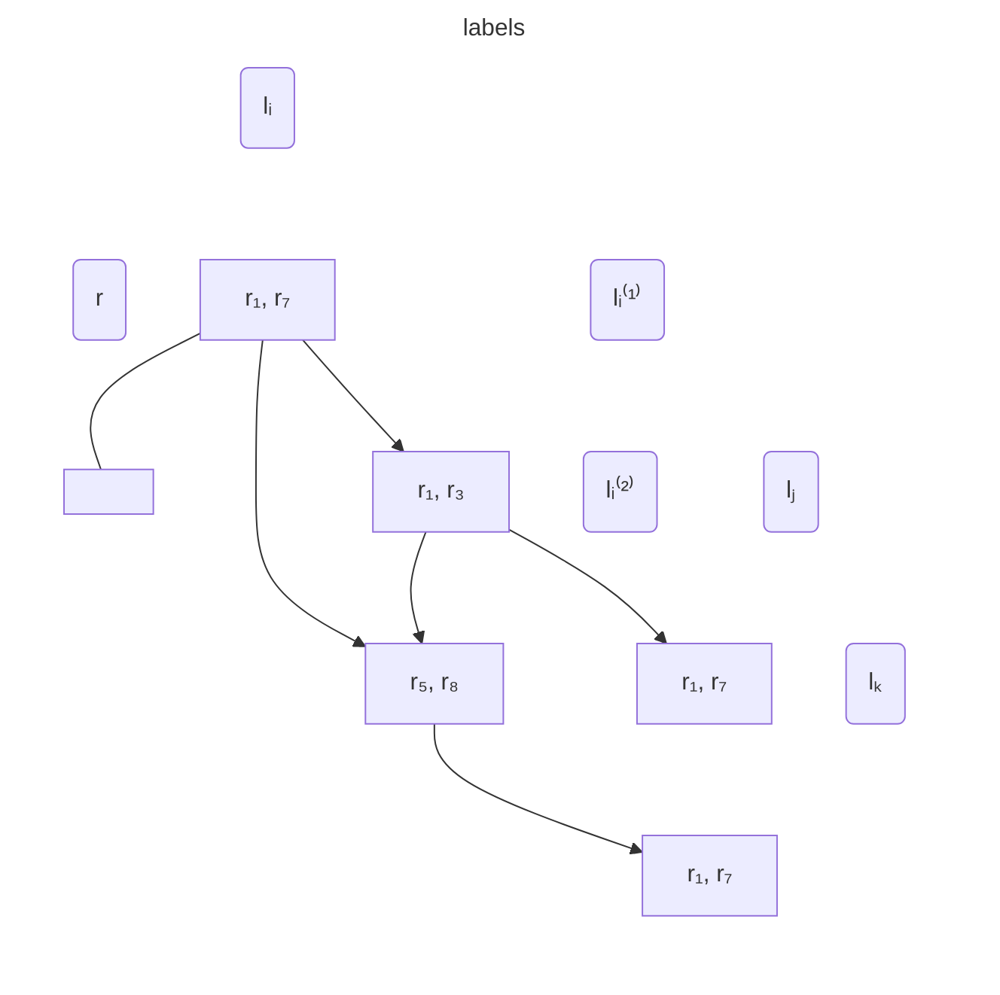

```mermaid
graph TD
    A[r₁, r₇] --- B[ ]
    A --> C[r₁, r₃]
    A --> D[r₅, r₈]
    C --> E[r₁, r₇]
    D --> F[r₁, r₇]
    C --> D

    subgraph "labels"
    direction TB
    l1("lᵢ") ~~~ A
    r_label("r") ~~~ B
    l1_1("lᵢ⁽¹⁾") ~~~ C
    l1_2("lᵢ⁽²⁾") ~~~ D
    lj("lⱼ") ~~~ E
    lk("lₖ") ~~~ F
    end

    style labels fill:none,stroke:none

```